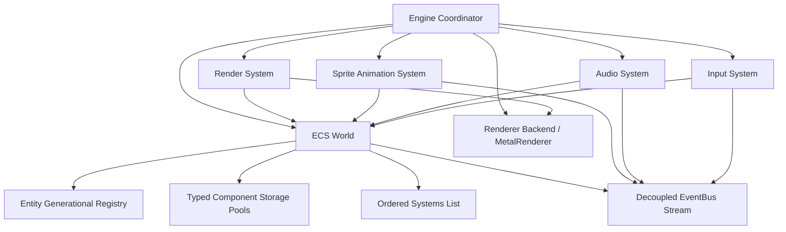

# AcornEngine Developer Skill

This skill provides comprehensive architectural guidance, API patterns, and recipes for developers building games and interactive 2D/3D applications with **AcornEngine**.

---

## Work Decision Tree

Use this decision tree to quickly jump to the right workflow:

```
What are you implementing?
 ├── 1. Initializing an App / MTKView Loop
 │    └── See [Lifecycle & Setup](references/lifecycle-and-setup.md)
 ├── 2. Game Logic, Entities & Systems
 │    └── See [ECS Architecture](references/ecs-architecture.md)
 ├── 3. System-to-System Messaging & Event Dispatch
 │    └── See [EventBus Guide](references/event-bus.md)
 ├── 4. 2D Sprites, Atlases, Flipbook Animations, or Tilemaps
 │    └── See [2D Sprites & Animation](references/2d-sprites-and-animation.md)
 ├── 5. 3D Models (glTF), Meshes, Lights, or Cameras
 │    └── See [3D Rendering & Lighting](references/3d-rendering-and-lighting.md)
 ├── 6. Rigid Bodies, Collisions, or Triggers (Box2D)
 │    └── See [Physics & Collisions](references/physics-and-collisions.md)
 ├── 7. Gamepads, Keyboard, Mouse, or Touch Input
 │    └── See [Unified Input Handling](references/input-handling.md)
 ├── 8. 3D Positional Sound Effects or Audio Playback
 │    └── See [Spatial Audio](references/spatial-audio.md)
 ├── 9. Scalable Text (SDF) or Particle Systems
 │    └── See [Text & Particles](references/text-and-particles.md)
 ├── 10. Complete Copy-Pasteable Implementation Recipes
 │    └── See [Recipes & Code Patterns](references/recipes-and-patterns.md)
 └── 11. Performance Optimization & Swift 6 Safety
      └── See [Best Practices & Guidelines](references/best-practices.md)
```

---

## Core Engine Architecture

AcornEngine is built on a modular, data-oriented foundation strictly isolated to `@MainActor` with Swift 6 strict concurrency safety:



### The Six Architectural Pillars
1. **ECS (Entity Component System)**: Lightweight generational entities, pure `Sendable` `Component` structs, and `@MainActor` `System` classes.
2. **Decoupled EventBus**: Type-safe immediate closures (`subscribe`) and per-frame buffered queues (`events(ofType:)`).
3. **2D Sprite Flipbook Animation**: Multi-mode playback (`.once`, `.loop`, `.pingPong`), trigger events (footsteps, hitboxes), and automatic clip extraction from sprite sheets or Aseprite tags.
4. **Metal Rendering & Automatic GPU Instancing**: Hardware-accelerated 3D meshes, 2D sprites, SDF text, and automated batching (`renderInstanced` / `renderSpritesInstanced`).
5. **Unified Input & Spatial Audio**: Multi-device hardware polling (Keyboard, Mouse, Multi-touch, Game Controllers) and 3D spatial sound via `AVAudioEngine` & `AVAudioEnvironmentNode`.
6. **Native 2D Physics**: Box2D v3 integration with rigid body dynamics, contact manifold events (`CollisionEnter/Stay/Exit`), and trigger volumes (`SensorEnter/Stay/Exit`).

---

## Subsystem Reference Index

| Topic | Reference Document | Description |
| :--- | :--- | :--- |
| **Lifecycle & Setup** | [lifecycle-and-setup.md](references/lifecycle-and-setup.md) | `Engine`, `MetalRenderer`, `MTKViewDelegate`, surface events, and delta time clamping. |
| **ECS Architecture** | [ecs-architecture.md](references/ecs-architecture.md) | `Entity`, `Component`, `System`, zero-allocation queries (`forEach`, `mutateComponent`), and hierarchy (`ParentComponent`). |
| **EventBus** | [event-bus.md](references/event-bus.md) | Defining events, publishing, subscriptions, frame-buffered queries, and built-in events. |
| **2D Sprites & Animation** | [2d-sprites-and-animation.md](references/2d-sprites-and-animation.md) | `SpriteComponent`, `SpriteSheet`, flipbook playback, triggers, and `TileMapComponent`. |
| **3D Rendering & Lighting** | [3d-rendering-and-lighting.md](references/3d-rendering-and-lighting.md) | `MeshComponent`, glTF loading, GPU instancing, `LightComponent`, and camera tracking/orbit. |
| **Physics & Collisions** | [physics-and-collisions.md](references/physics-and-collisions.md) | Box2D v3 bodies, box/circle colliders, sensor triggers, contact manifolds, and event handling. |
| **Unified Input** | [input-handling.md](references/input-handling.md) | Keyboard, mouse, touch, and Apple GameController polling and events. |
| **Spatial Audio** | [spatial-audio.md](references/spatial-audio.md) | `AudioListenerComponent`, `AudioSourceComponent` (HRTF / spherical), and one-shot `PlaySoundEvent`. |
| **Text & Particles** | [text-and-particles.md](references/text-and-particles.md) | Scalable SDF text generation (`TextComponent`) and entity-based particle systems. |
| **Recipes & Patterns** | [recipes-and-patterns.md](references/recipes-and-patterns.md) | End-to-end recipes: 2D platformer character, 3D glTF scene, and scene cleanup. |
| **Best Practices** | [best-practices.md](references/best-practices.md) | Concurrency safety, zero-allocation ECS patterns, draw call minimization, and physics rules. |

---

## Quick Start Template

A minimal functional AcornEngine scene:

```swift
import UIKit
import MetalKit
import AcornEngine

@MainActor
public class MinimalGameController: UIViewController, MTKViewDelegate {
    private var engine: Engine!
    private var renderer: MetalRenderer!
    private var commandQueue: MTLCommandQueue!
    private var lastTime: CFTimeInterval = 0

    override public func viewDidLoad() {
        super.viewDidLoad()
        guard let mtkView = view as? MTKView,
              let device = MTLCreateSystemDefaultDevice(),
              let queue = device.makeCommandQueue() else { return }

        self.commandQueue = queue
        mtkView.device = device
        mtkView.colorPixelFormat = .bgra8Unorm_srgb
        mtkView.depthStencilPixelFormat = .depth32Float
        mtkView.delegate = self

        do {
            renderer = try MetalRenderer(device: device)
            engine = Engine(renderer: renderer)

            // Setup Camera
            let camera = engine.world.createEntity()
            engine.world.addComponent(TransformComponent(position: [0, 0, -10]), to: camera)
            engine.world.addComponent(
                CameraComponent(
                    projectionType: .orthographic,
                    orthographicSize: 5.0,
                    aspectRatio: Float(view.bounds.width / max(view.bounds.height, 1))
                ),
                to: camera
            )
        } catch {
            print("Failed to initialize engine: \(error)")
        }
    }

    public func draw(in view: MTKView) {
        guard let engine = engine,
              let queue = commandQueue,
              let drawable = view.currentDrawable,
              let descriptor = view.currentRenderPassDescriptor,
              let buffer = queue.makeCommandBuffer() else { return }

        let now = CACurrentMediaTime()
        let dt = lastTime == 0 ? (1.0 / 60.0) : (now - lastTime)
        lastTime = now

        engine.tick(deltaTime: dt)

        let context = MetalRenderContext(renderPassDescriptor: descriptor, commandBuffer: buffer)
        _ = context.getOrCreateEncoder()
        engine.render(context: context)
        context.endEncoding()

        buffer.present(drawable)
        buffer.commit()
    }

    public func mtkView(_ view: MTKView, drawableSizeWillChange size: CGSize) {}
}
```

---

## Verification & Testing Workflows

1. **Build the Engine Package**:
   ```bash
   swift build
   ```
2. **Run Automated Test Suite**:
   ```bash
   swift test
   ```
3. **Visual Verification (iOS Simulator)**:
   For rendering, UI, or shader changes, follow the visual verification workflow in `.agents/AGENTS.md`:
   - Build sample app: `xcodebuild -project Samples/AcornSampleApp/AcornSampleApp.xcodeproj -scheme AcornSampleApp -configuration Debug -sdk iphonesimulator -derivedDataPath build_output build`
   - Install and launch on booted simulator with `simctl`.
   - Take and inspect simulator screenshots using `xcrun simctl io <device-id> screenshot`.
