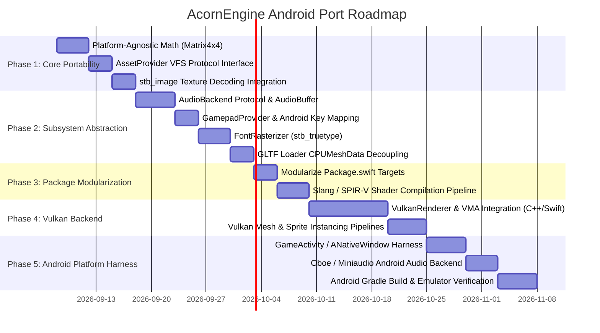

# AcornEngine - Android Platform Support & Compatibility Plan

This document outlines the architectural blueprint, subsystem abstractions, and phased implementation roadmap required to bring **AcornEngine** to the **Android** platform (targeting Android API 24+ on `arm64-v8a` and `x86_64`), while maintaining complete parity and performance on **macOS 13+** and **iOS 16+**.

---

## 1. Executive Summary & Architectural Goals

AcornEngine's core foundation—built on Swift 6 with strict concurrency (`Sendable`, `@MainActor`), a type-safe Entity-Component-System (ECS), and a decoupled `EventBus`—is inherently portable. However, the engine currently exhibits platform lock-in across five key subsystem boundaries:

```
┌────────────────────────────────────────────────────────────────────────────────────────┐
│                                 AcornEngine ECS Core                                   │
│            (World, Entity, ComponentPool, EventBus, Systems, Box2D Physics)            │
└────────────┬────────────────────────┬──────────────────────┬───────────────────────────┘
             │                        │                      │
             ▼                        ▼                      ▼
┌────────────────────────┐ ┌────────────────────┐ ┌─────────────────────┐
│  Renderer (Protocol)   │ │AudioBackend (Proto)│ │GamepadProvider/Input│
│  + createMesh(...)     │ │+ play(...)         │ │+ pollGamepads(...)  │
│  + createTexture(...)  │ │+ setListener(...)  │ │+ processEvents(...) │
└───────────┬────────────┘ └──────────┬─────────┘ └──────────┬──────────┘
            │                         │                      │
     ┌──────┴──────┐           ┌──────┴──────┐        ┌──────┴──────┐
     ▼             ▼           ▼             ▼        ▼             ▼
[MetalRenderer] [VulkanRenderer] [AVAudio]  [Oboe/   [Apple GC]  [Android NDK
 (Apple Silicon) (Android/Linux) (Apple)   miniaudio] (Apple)     AInputQueue]
```

### High-Level Goals
1. **First-Class Android Target**: Compile and run AcornEngine games natively on Android devices using modern Android Game Development Kit (AGDK) components (`GameActivity`, Vulkan, Oboe).
2. **Zero Overhead on Apple Platforms**: Retain current Metal, metal-cpp, and AVFoundation performance on macOS and iOS through clean protocol interfaces.
3. **Pure Swift Core**: Remove all Darwin SDK dependencies (e.g., Apple's `<simd/simd.h>`) from core engine targets.
4. **Single-Source Shaders & Assets**: Support unified shader pipelines (Slang/SPIRV-Cross) and asset packaging compatible with both Apple app bundles and Android APK containers.

---

## 2. Subsystem Gap Analysis & Target Architecture

| Subsystem | Current State (Apple Only) | Android Requirement | Abstraction Strategy |
| :--- | :--- | :--- | :--- |
| **Math** | Relies on Darwin SDK `import simd` (`simd_float4x4`, `matrix_multiply`) across 50+ files. | Darwin `simd` does not exist on Linux/Android. | Introduce pure-Swift `Matrix4x4` wrapping standard `SIMD4<Float>` with Darwin typealiases on Apple. |
| **Graphics API** | Hardcoded to Apple Metal via `metal-cpp` in `AcornMetal`. | Android requires Vulkan (`libvulkan.so`). | Implement `VulkanRenderer: Renderer` utilizing standard Vulkan 1.1+ and Vulkan Memory Allocator (VMA). |
| **Shaders** | Metal Shading Language (`Shaders.metal`). | Vulkan requires SPIR-V bytecode. | Author shaders in Slang or HLSL, compiling to SPIR-V (Vulkan) and MSL (Metal via `spirv-cross`). |
| **Textures** | Decodes via `MetalKit` (`MTKTextureLoader`), ImageIO, and CoreGraphics. | Android does not have MetalKit/CoreGraphics. | Integrate `stb_image.h` to decode PNG/JPEG on CPU to 32-bit RGBA, uploading via `renderer.createTexture`. |
| **Fonts & Text** | `SDFFontAtlasGenerator` renders glyphs with `CoreText` and `CoreGraphics`. | CoreText does not exist on Android. | Abstract font rasterization behind `protocol FontRasterizer` using `stb_truetype.h` or FreeType. |
| **Audio** | `AudioSystem` directly drives `AVAudioEngine`, `AVAudioEnvironmentNode`, and `AVAudioPCMBuffer`. | AVFoundation does not exist on Android. | Introduce `protocol AudioBackend`. Implement `AVAudioEngineBackend` (Apple) and `OboeBackend` / `MiniaudioBackend` (Android). |
| **Input & Gamepad** | Directly imports Apple's `GameController.framework`. `Key.swift` uses macOS keycodes. | Android delivers events via `AInputQueue` (`AMotionEvent`, `AKeyEvent`). | Introduce `protocol GamepadProvider`. Add `Key.from(androidKeyCode:)` and standard USB HID scancodes. |
| **App Lifecycle** | Passive `MTKViewDelegate.draw(in:)` loop. Empty `SceneDelegate` lifecycle stubs. | Android requires explicit `ANativeWindow` lifecycle handling (`surfaceDestroyed` must stop rendering). | Introduce engine lifecycle events (`AppPauseEvent`, `SurfaceDestroyedEvent`) and delta-time clamping. |
| **Asset Storage** | Directly opens POSIX paths via `Bundle.main.url`. | Android assets reside inside the APK zip and must be read via `AAssetManager`. | Introduce `protocol AssetProvider` with `BundleAssetProvider` and `AAssetManagerProvider`. |

---

## 3. Detailed Technical Specifications

### 3.1 Cross-Platform Math & Coordinate Systems
- **Matrix Representation**:
  Create a platform-agnostic math module `AcornMath`:
  ```swift
  public struct Matrix4x4: Sendable, Equatable {
      public var columns: (SIMD4<Float>, SIMD4<Float>, SIMD4<Float>, SIMD4<Float>)
      // Multiply, inverse, transpose, orthographic, and perspective projection helpers
  }
  #if canImport(simd)
  public typealias simd_float4x4 = Matrix4x4 // Or bidirectional conversion extensions
  #endif
  ```
- **Vulkan NDC Coordinate Mapping**:
  - Metal NDC depth is $[0, 1]$ with $+Y$ up.
  - Vulkan NDC depth is $[0, 1]$ with $+Y$ down.
  - **Solution**: Utilize Vulkan 1.1+ negative viewport height (`VK_KHR_maintenance1`):
    ```c
    VkViewport viewport = { 0.0f, (float)height, (float)width, -(float)height, 0.0f, 1.0f };
    ```
    This enables 100% matrix calculation reuse between Metal and Vulkan without shader or projection matrix modifications.

### 3.2 Virtual File System & Asset Loading (`AssetProvider`)
On Android, asset files cannot be opened with `fopen()` or `file://` URLs.
```swift
public protocol AssetProvider: Sendable {
    func loadData(named path: String) throws -> Data
    func exists(named path: String) -> Bool
}

// Apple Implementation
public final class BundleAssetProvider: AssetProvider {
    private let bundle: Bundle
    public init(bundle: Bundle = .main) { self.bundle = bundle }
    public func loadData(named path: String) throws -> Data { ... }
}

// Android NDK Implementation
public final class AndroidAssetProvider: AssetProvider {
    private let assetManager: OpaquePointer // AAssetManager*
    public init(assetManager: OpaquePointer) { self.assetManager = assetManager }
    public func loadData(named path: String) throws -> Data {
        // AAssetManager_open -> AAsset_read -> Data
    }
}
```

### 3.3 Audio Subsystem Decoupling (`AudioBackend`)
1. **Portable Audio Buffer**:
   Replace `AVAudioPCMBuffer` inside `AudioClip` with a platform-neutral PCM container:
   ```swift
   public struct AudioBuffer: Sendable {
       public let sampleRate: Double
       public let channelCount: Int
       public let frameCount: Int
       public let samples: [Float]
   }
   ```
2. **AudioBackend Protocol**:
   ```swift
   public protocol AudioBackend: AnyObject, Sendable {
       func start() throws
       func stop()
       func pause()
       func resume()
       func setListener(position: SIMD3<Float>, orientation: SIMD3<Float>, masterVolume: Float)
       func play(clip: AudioClip, isSpatial: Bool, isLooping: Bool, position: SIMD3<Float>?, volume: Float, pitch: Float) -> AudioVoiceId
       func updateVoice(_ id: AudioVoiceId, position: SIMD3<Float>?, volume: Float, pitch: Float)
       func stopVoice(_ id: AudioVoiceId)
   }
   ```
3. **Android Audio Backend**:
   Implement using **Oboe** (C++ high-performance audio library from Google) or **miniaudio** (single-file C header supporting AAudio/OpenSL ES on Android and CoreAudio on Apple).

### 3.4 Input & Gamepad Decoupling
1. **Abstract Gamepad Provider**:
   ```swift
   public protocol GamepadProvider: AnyObject, Sendable {
       func pollGamepads(inputState: InputState, eventBus: EventBus)
   }
   ```
   - `AppleGamepadProvider`: Wraps `GCController` from Apple's `GameController.framework`.
   - `AndroidGamepadProvider`: Listens to `AInputEvent` motion events (`AXIS_X`, `AXIS_Y`, `AXIS_Z`, `AXIS_RZ`, `AXIS_LTRIGGER`, `AXIS_RTRIGGER`) and button key events.
2. **Key Code Mapping**:
   Add Android keycode translation in `Key.swift`:
   ```swift
   extension Key {
       public static func from(androidKeyCode: Int32) -> Key? { ... }
   }
   ```

### 3.5 Vulkan Rendering Backend (`AcornVulkan`)
Structure the Vulkan backend to mirror the successful `AcornMetal` architecture:
1. **C++ Core (`AcornVulkan`)**:
   - `AcornVulkanRenderer`: Manages `VkInstance`, `VkPhysicalDevice`, `VkDevice`, graphics/present queues, and swapchain recreation.
   - Buffer & Image allocation via **Vulkan Memory Allocator (VMA)**.
   - Pipelines: 5 Vulkan pipelines mirroring the MSL shaders (3D mesh, SDF text, 2D sprite, instanced 3D, instanced 2D).
2. **Swift Interface**:
   - `VulkanRenderer: Renderer` implementing `createMesh`, `createTexture`, `render`, `renderInstanced`, and `renderSpritesInstanced`.
   - `VulkanRenderContext: RenderContext` wrapping `VkCommandBuffer` and current `VkFramebuffer`.

### 3.6 Android OS Lifecycle & Window Integration
1. **App Entry Point**:
   Use Android Jetpack's **`GameActivity`** (AGDK):
   ```c
   void android_main(struct android_app* state) {
       // Initialize AcornEngine, Vulkan surface, and GameActivity event loop
   }
   ```
2. **Surface & Pause Lifecycle Handling**:
   - **`APP_CMD_INIT_WINDOW`**: Create `VkSurfaceKHR` using `vkCreateAndroidSurfaceKHR` and initialize swapchain.
   - **`APP_CMD_TERM_WINDOW`**: Crucial Android requirement—destroy Vulkan swapchain and pause render loop. Rendering to an invalid window causes `SIGSEGV`.
   - **`APP_CMD_PAUSE`**: Stop audio stream, reset active inputs (`inputState.reset()`), publish `AppPauseEvent`.
   - **`APP_CMD_RESUME`**: Restart audio stream, publish `AppResumeEvent`, reset clock timer to prevent `deltaTime` spikes.

---

## 4. Phased Implementation Roadmap



### Milestone Details

#### Phase 1: Core Portability & Clean-up (Foundation)
- Implement `AcornMath` with pure Swift vector/matrix math.
- Create `AssetProvider` protocol; update all asset loaders (`TextureLoader`, `SpriteSheet`, `AudioClip`) to use `AssetProvider`.
- Replace `MTKTextureLoader` with `stb_image.h` across all platforms.

#### Phase 2: Subsystem Abstractions
- Decouple audio graph behind `AudioBackend` protocol; extract AVFoundation code into `AVFoundationAudioBackend`.
- Decouple gamepads behind `GamepadProvider` protocol; extract Apple GameController code into `AppleGamepadProvider`.
- Abstract font glyph rasterization behind `FontRasterizer` protocol with `stb_truetype` fallback.
- Refactor `GLTFLoader.cpp` to output pure `CPUMeshData`.

#### Phase 3: Package Modularization & Shaders
- Reorganize `Package.swift` into modular targets:
  - `AcornCore` (ECS, Math, Events, Input state, Physics, Box2D, AssetProvider)
  - `AcornRenderMetal` (Metal backend for iOS/macOS)
  - `AcornRenderVulkan` (Vulkan backend for Android/Linux)
  - `AcornAudioAVF` (Apple AVFoundation audio)
  - `AcornAudioOboe` (Android Oboe audio)
- Set up shader build script producing SPIR-V and MSL bytecode.

#### Phase 4: Vulkan Rendering Backend
- Create `AcornVulkan` C++ module with Vulkan Memory Allocator (VMA).
- Implement `VulkanRenderer: Renderer` supporting forward 3D, SDF text, 2D sprites, and instanced draw batching.

#### Phase 5: Android Harness, Toolchain & Samples
- Create Android Gradle project structure (`android/`) with `build.gradle.kts`.
- Configure `swift-sdk-android` cross-compilation toolchain for `aarch64-unknown-linux-android24`.
- Integrate `GameActivity` and `ANativeWindow` surface lifecycle.
- Port sample game (e.g. `AcornJump` or `AcornSampleApp`) to verify touch controls, Vulkan rendering, physics, and audio on Android devices.
