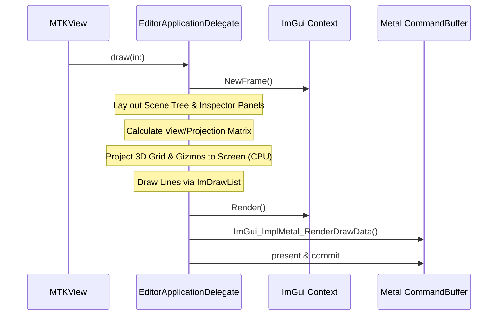

# Acorn Editor

Acorn Editor is a native macOS desktop application designed for real-time visualization, inspection, and manipulation of [AcornEngine](file:///Users/tsharju/Code/AcornEngine/Engine/README.md) worlds. Built using Swift 6 with C++ interoperability, it combines Apple's native **Cocoa** windowing and **MetalKit** rendering with the **Dear ImGui** immediate-mode graphical user interface.

---

## Key Features

1. **Scene Tree View**:
   - Lists all active entities in the [World](file:///Users/tsharju/Code/AcornEngine/Engine/Sources/AcornEngine/ECS/World.swift) in real time.
   - Provides a one-click interface to dynamically spawn new [Entity](file:///Users/tsharju/Code/AcornEngine/Engine/Sources/AcornEngine/ECS/Entity.swift) instances.
   - Allows selecting individual entities to view and edit their properties.

2. **Entity Inspector**:
   - Inspects all components attached to the currently selected entity.
   - Integrates custom GUI controls for [TransformComponent](file:///Users/tsharju/Code/AcornEngine/Engine/Sources/AcornEngine/Core/Components/TransformComponent.swift), enabling real-time drag-and-drop modification of **Position**, **Rotation**, and **Scale** coordinates.
   - Automatically reflects modified parameters in the simulation.
   - Displays textual fallbacks for custom components without native editor overrides.

3. **Interactive World View**:
   - Projects and visualizes the scene using 3D-to-2D CPU projection drawing.
   - Renders a multi-line reference grid on the XZ plane.
   - Draws local coordinate axis gizmos (X: Red, Y: Green, Z: Blue) directly at each entity's position, reflecting its translation, rotation, and scale.
   - Supports camera toggles between:
     - **Editor Camera**: A free-floating camera with controls for Position, Pitch, and Yaw.
     - **Scene Camera**: Uses the active [CameraComponent](file:///Users/tsharju/Code/AcornEngine/Engine/Sources/AcornEngine/Core/Components/CameraComponent.swift) and its associated entity transform defined in the ECS world.

---

## Directory & Package Structure

The Editor is organized as a Swift Package located in the [Editor](file:///Users/tsharju/Code/AcornEngine/Editor) directory:

* [Package.swift](file:///Users/tsharju/Code/AcornEngine/Editor/Package.swift): Configures the executable package.
  - Leverages Swift C++ Interoperability (`.interoperabilityMode(.Cxx)`) to compile and bind the Dear ImGui library.
  - Declares a dependency on the local [AcornEngine](file:///Users/tsharju/Code/AcornEngine/Engine/README.md) target.
* [Sources/AcornEditor/main.swift](file:///Users/tsharju/Code/AcornEngine/Editor/Sources/AcornEditor/main.swift): Contains the core application delegate and update loop.
* [Sources/ImGui/](file:///Users/tsharju/Code/AcornEngine/Editor/Sources/ImGui): Wraps the Dear ImGui sources (`imgui.cpp`, `imgui_impl_metal.mm`, `imgui_impl_osx.mm`, etc.) into a compiled Swift Package target.

---

## Architectural Breakdown

### Application Lifecycle

The entry point in [main.swift](file:///Users/tsharju/Code/AcornEngine/Editor/Sources/AcornEditor/main.swift#L322-L325) instantiates a shared Cocoa application and binds the custom [EditorApplicationDelegate](file:///Users/tsharju/Code/AcornEngine/Editor/Sources/AcornEditor/main.swift#L8):

```swift
let app = NSApplication.shared
let delegate = EditorApplicationDelegate()
app.delegate = delegate
app.run()
```

The delegate manages:
- **Window Initialization**: Creates a native macOS `NSWindow` and embeds a MetalKit `MTKView`.
- **ImGui Context Initialization**: Registers the Metal device and binds OSX / Metal render loops to the ImGui backend via:
  - `ImGui_ImplOSX_Init(view)`
  - `ImGui_ImplMetal_Init(device)`
- **ECS World Setup**: Instantiates a default [World](file:///Users/tsharju/Code/AcornEngine/Engine/Sources/AcornEngine/ECS/World.swift) instance and populates it with initial test entities.

### Core Render Loop

The loop is driven via the `MTKViewDelegate` implementation in [main.swift](file:///Users/tsharju/Code/AcornEngine/Editor/Sources/AcornEditor/main.swift#L66-L320):



1. **New Frame**: Sets up Cocoa and Metal contexts for Dear ImGui.
2. **UI Layout**:
   - Left side: Scene Tree (top) and Inspector (bottom) windows are displayed at fixed positions.
   - Right side: World View window takes up the remaining viewport space.
3. **CPU Vector Projection**:
   - The view-projection matrix ($MVP$) is evaluated using either the interactive Editor Camera parameters or the active scene [CameraComponent](file:///Users/tsharju/Code/AcornEngine/Engine/Sources/AcornEngine/Core/Components/CameraComponent.swift).
   - Local vertices (grid lines, entity coordinate axes) are projected into screen coordinates:
     $$x_{\text{screen}} = \frac{v_{\text{ndc}.x} + 1.0}{2.0} \times W_{\text{viewport}} + X_{\text{offset}}$$
     $$y_{\text{screen}} = \frac{1.0 - v_{\text{ndc}.y}}{2.0} \times H_{\text{viewport}} + Y_{\text{offset}}$$
   - Projected segments are pushed to the window's `ImDrawList` via C++ bindings.
4. **Drawing & Presentation**: Renders the ImGui graphics data into the MTKView's current pass using the Metal command encoder, and commits the frame.

---

## Getting Started

### Prerequisites

- **macOS**: Version 13.0 or later.
- **Xcode**: Version 15.0 or later (supporting Swift 6.0+ with C++ Interoperability).

### Running the Editor

To build and run the Editor executable via Swift Package Manager:

1. Open your terminal and navigate to the Editor directory:
   ```bash
   cd Editor
   ```
2. Run the executable target:
   ```bash
   swift run
   ```
