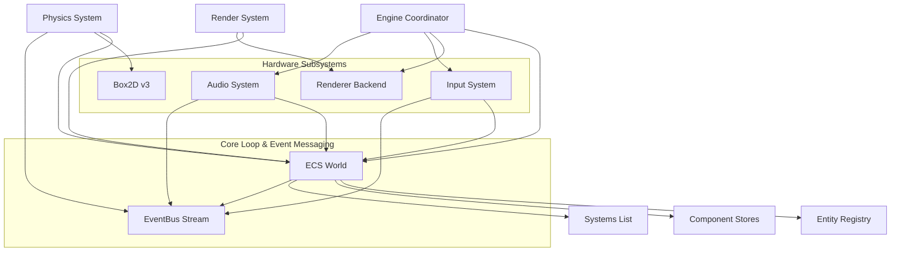
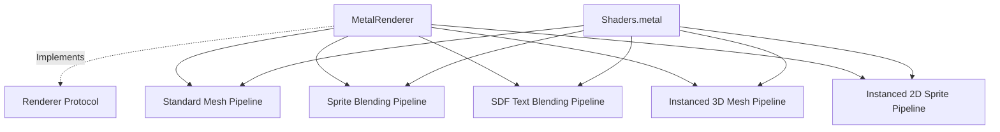
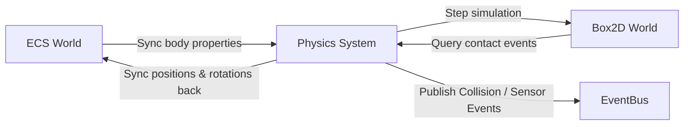
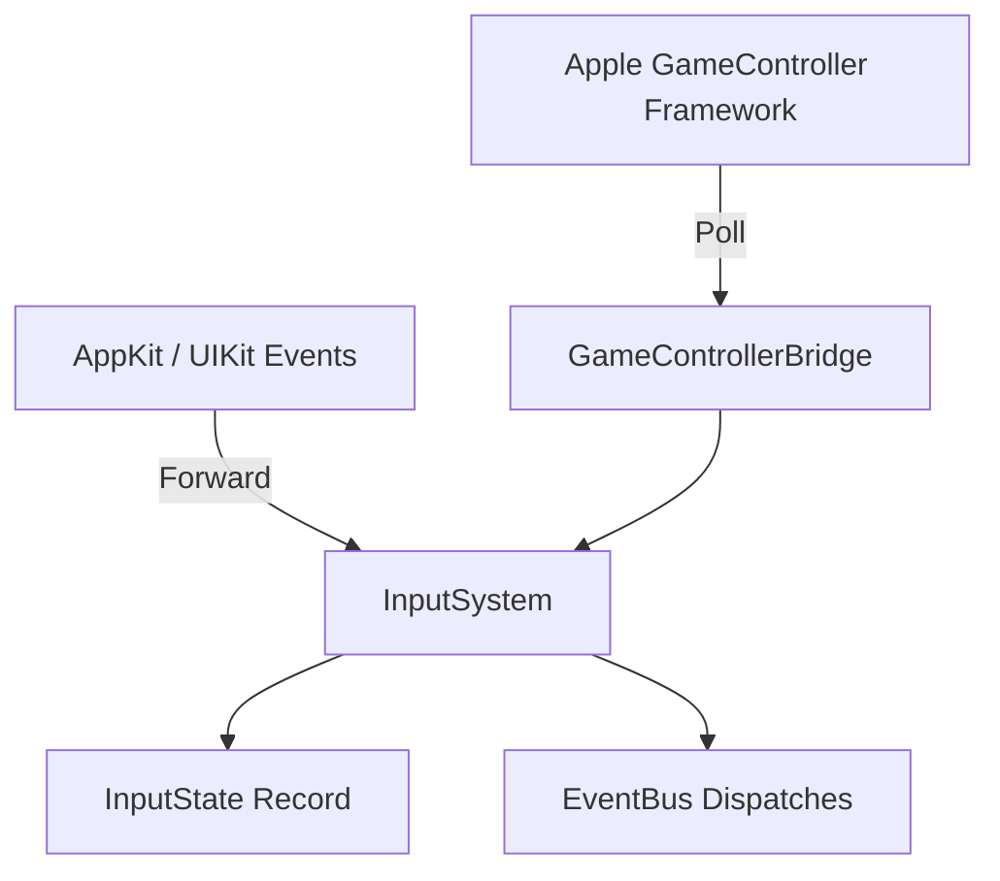
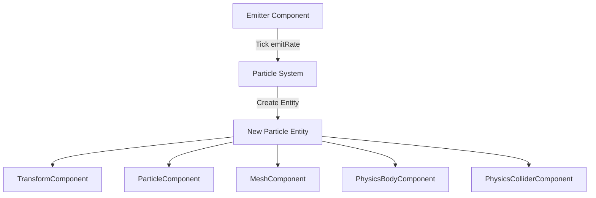

# AcornEngine Documentation

AcornEngine is a modern, high-performance 2D/3D game engine targeting Apple platforms (**iOS 16+** and **macOS 13+**). It is built using **Swift 6** with strict concurrency safety (`Sendable` conformance and `@MainActor` isolation where appropriate) and leverages the **Metal** graphics API for hardware-accelerated rendering.

---

## Architecture Overview

AcornEngine is designed around a modular, data-oriented architecture:


The engine is built upon five foundational pillars:
1. **ECS (Entity Component System)**: High-performance data separation where entities are lightweight IDs, components are pure data structs, and systems contain the logic.
2. **Decoupled EventBus**: Type-safe event streaming and frame-buffered message queues enabling systems to communicate without tight coupling.
3. **Metal Rendering Backend & GPU Instancing**: Hardware-accelerated graphics pipeline supporting instanced 3D meshes, batched 2D sprites, tilemaps, and scalable Signed Distance Field (SDF) text.
4. **Unified Input & Audio Subsystems**: Multi-device hardware abstraction (Keyboard, Mouse, Touch, Game Controllers) and 3D spatial sound processing via `AVAudioEngine`.
5. **Native 2D Physics Engine**: Box2D v3 rigid body simulation, contact callbacks, and sensor trigger volumes.

---

## 1. Entity Component System (ECS) & EventBus

Located under [Engine/Sources/AcornEngine/ECS](file:///Users/tsharju/Code/AcornEngine/Engine/Sources/AcornEngine/ECS):

### [Entity](file:///Users/tsharju/Code/AcornEngine/Engine/Sources/AcornEngine/ECS/Entity.swift)
A lightweight, unique identifier representing an object in the world.
* **Type**: `struct`
* **Conformances**: `Hashable`, `Sendable`
* **Properties**:
  * `id: UInt64`: The unique ID assigned to the entity.

### [Component](file:///Users/tsharju/Code/AcornEngine/Engine/Sources/AcornEngine/ECS/Component.swift)
A marker protocol that all components must conform to.
* **Type**: `protocol`
* **Conformances**: `Sendable`
* **Design Guideline**: Components should contain only raw data and state, leaving logic entirely to systems.

### [System](file:///Users/tsharju/Code/AcornEngine/Engine/Sources/AcornEngine/ECS/System.swift)
A protocol representing logic that runs on entities and components.
* **Type**: `protocol`
* **Isolation**: `@MainActor`
* **Requirements**:
  * `func update(world: World, deltaTime: Double)`: Performs logic updates on the world state.

### [Event](file:///Users/tsharju/Code/AcornEngine/Engine/Sources/AcornEngine/ECS/Event.swift)
A marker protocol for all decoupleable event structures published across systems.
* **Type**: `protocol`
* **Conformances**: `Sendable`

### [EventBus](file:///Users/tsharju/Code/AcornEngine/Engine/Sources/AcornEngine/ECS/EventBus.swift)
A decoupled publish-subscribe and frame-buffered event stream.
* **Type**: `class`
* **Isolation**: `@MainActor`
* **Key Features**:
  * **Immediate Dispatch (`subscribe`)**: Subscribes a closure invoked immediately when matching events are published. Returns an `EventSubscription` token that can be cancelled.
  * **Event Publishing (`publish`)**: Dispatches the event to registered immediate callbacks and appends it to the current frame's buffered event queue.
  * **Frame Queries (`events(ofType:)` / `hasEvents(ofType:)`)**: Systems can query all events of a specific type buffered during the current tick/frame.
  * **Frame Clearance (`clear()`)**: Clears buffered events at the end of each frame (invoked automatically during `world.update()`).

```swift
// Subscribing to an event
let sub = world.eventBus.subscribe(CollisionEnterEvent.self) { event in
    print("Collision between entity \(event.entityA.id) and \(event.entityB.id)")
}

// Querying buffered frame events inside a System
let touchEvents = world.eventBus.events(ofType: TouchBeganEvent.self)
for touch in touchEvents {
    // Process touch
}
```

### [World](file:///Users/tsharju/Code/AcornEngine/Engine/Sources/AcornEngine/ECS/World.swift)
The central registry that manages the lifetime of entities, component storage, systems, and the shared event bus.
* **Type**: `class`
* **Isolation**: `@MainActor`
* **Key Features**:
  * **Entity Lifetimes**: Creates (`createEntity()`) and destroys (`destroyEntity()`) entities. Destroying an entity automatically cleans up all associated components and removes child hierarchies.
  * **Component Management**: Add, remove, or retrieve components dynamically for any entity via type-safe generics:
    * `addComponent<T: Component>(_ component: T, to entity: Entity)`
    * `removeComponent<T: Component>(ofType type: T.Type, from entity: Entity)`
    * `component<T: Component>(ofType type: T.Type, for entity: Entity) -> T?`
  * **Entity Queries**: Retrieve lists of entities possessing a specific component type via `entities(with type: T.Type)`.
  * **System Registration**: Systems are executed in the order they are registered via `registerSystem(_:)` whenever `update(deltaTime:)` is called.
  * **Hierarchy Resolution**: Provides `worldMatrix(for:)` and `worldPosition(for:)` to resolve nested transformations through `ParentComponent` chains.

---

## 2. Rendering & Graphics Pipeline

Located under [Engine/Sources/AcornEngine/Renderer](file:///Users/tsharju/Code/AcornEngine/Engine/Sources/AcornEngine/Renderer):



### [Renderer (Protocol)](file:///Users/tsharju/Code/AcornEngine/Engine/Sources/AcornEngine/Renderer/Renderer.swift)
An abstraction over graphics device APIs, facilitating multi-backend support.
* **Key Methods**:
  * `createMesh(vertices: [Vertex]) -> Mesh?`: Generates a hardware vertex buffer.
  * `render(mesh: Mesh, texture: (any Texture)?, uniforms: GlobalUniforms, context: RenderContext)`: Draws a single 3D mesh.
  * `renderText(mesh: Mesh, texture: any Texture, uniforms: SDFUniforms, context: RenderContext)`: Draws text using the SDF shader.
  * `renderSprite(mesh: Mesh, texture: any Texture, uniforms: SpriteUniforms, context: RenderContext)`: Draws a single sprite or tile map quad.
  * `renderInstanced(mesh: any Mesh, texture: (any Texture)?, instances: [MeshInstanceData], uniforms: FrameUniforms, context: RenderContext)`: Renders multiple instances of a 3D mesh in a single GPU draw call.
  * `renderSpritesInstanced(mesh: any Mesh, texture: any Texture, instances: [SpriteInstanceData], uniforms: SpriteFrameUniforms, context: RenderContext)`: Renders batched 2D sprite instances in a single GPU draw call.
  * `unitQuadMesh: (any Mesh)?`: Shared unit quad geometry for 2D sprite batching.

### [MetalRenderer](file:///Users/tsharju/Code/AcornEngine/Engine/Sources/AcornEngine/Renderer/MetalRenderer.swift)
The concrete implementation of the renderer using Apple's Metal API.
* **Pipelines**: Initializes specialized pipeline states compiled from [Shaders.metal](file:///Users/tsharju/Code/AcornEngine/Engine/Sources/AcornEngine/Renderer/Shaders.metal):
  1. **Standard Pipeline**: Single 3D mesh rendering with vertex colors, textures, ambient, directional, and point lighting.
  2. **Sprite Pipeline**: Alpha-blended 2D texture rendering with color tints.
  3. **SDF Text Pipeline**: Alpha-blended signed distance field rendering for scalable glyphs and outlines.
  4. **Instanced Mesh Pipeline**: Hardware instanced 3D rendering driven by per-instance dynamic model matrices, normal matrices, and colors (`drawIndexedPrimitives:instanceCount:` / `drawPrimitives:instanceCount:`).
  5. **Instanced Sprite Pipeline**: Hardware instanced 2D sprite rendering driven by per-instance model matrices, tint colors, and normalized atlas UV bounding rectangles.
* **Context**: Uses `MetalRenderContext` to hold the current command buffer and render pass descriptor with thread-safe encoding.

### Uniforms & Instance Structures
* **`GlobalUniforms`**: Model-View-Projection matrix, model matrix, normal matrix, mesh color tint, and light parameters (ambient, directional, point).
* **`FrameUniforms`**: View-Projection matrix and scene lighting parameters shared across instanced 3D draw calls.
* **`MeshInstanceData`**: Per-instance `modelMatrix`, `normalMatrix`, and RGBA `color`.
* **`SpriteFrameUniforms`**: Frame-level View-Projection matrix for 2D sprite passes.
* **`SpriteInstanceData`**: Per-instance `modelMatrix`, `colorTint`, and `uvRect` (`SIMD4<Float>` bounding coordinates $[u_{\min}, v_{\min}, u_{\max}, v_{\max}]$).
* **`SDFUniforms`**: Model-View-Projection matrix, `textColor`, `outlineColor`, `outlineWidth`, and anti-aliasing `edgeWidth`.

### Texture & Data Loading
* **[Texture (Protocol)](file:///Users/tsharju/Code/AcornEngine/Engine/Sources/AcornEngine/Renderer/Texture.swift)**: Common interface for texture resources.
* **[MetalTexture](file:///Users/tsharju/Code/AcornEngine/Engine/Sources/AcornEngine/Renderer/MetalTexture.swift)**: Wraps a Metal `MTLTexture`.
* **[TextureLoader](file:///Users/tsharju/Code/AcornEngine/Engine/Sources/AcornEngine/Renderer/TextureLoader.swift)**: Decodes images asynchronously from `URL` or `Data` using `MTKTextureLoader`, or uploads raw `[UInt8]` pixel arrays (supporting single-channel `.r8Unorm` for fonts or 4-channel `.rgba8Unorm` formats).

### [GLTFModelLoader](file:///Users/tsharju/Code/AcornEngine/Engine/Sources/AcornEngine/Renderer/GLTFModelLoader.swift)
Responsible for parsing and loading glTF models (`.glb` / `.gltf`) from disk.
* **Implementation**: Wraps a C++ backend (`AcornMetal` parser) built on top of `fastgltf` and `simdjson`.
* **Output**: Extracts arrays of `MetalMesh` buffers, `GLTFNode` structural configurations (translation, rotation, scale, parents), and embedded texture image binary payloads.

### Mesh & Geometry Basics
* **[Vertex](file:///Users/tsharju/Code/AcornEngine/Engine/Sources/AcornEngine/Renderer/Vertex.swift)**: A 16-byte aligned struct containing:
  * `position: SIMD3<Float>`: 3D position vector.
  * `color: SIMD4<Float>`: Vertex RGBA color.
  * `texCoord: SIMD2<Float>`: Texture coordinate (UV) for model mapping.
  * `normal: SIMD3<Float>`: 3D normal vector for surface shading calculations.
* **[MetalMesh](file:///Users/tsharju/Code/AcornEngine/Engine/Sources/AcornEngine/Renderer/MetalMesh.swift)**: Implements the opaque `Mesh` protocol, managing an underlying `MTLBuffer` with shared storage.
* **[BasicShapeGenerator](file:///Users/tsharju/Code/AcornEngine/Engine/Sources/AcornEngine/Renderer/BasicShapeGenerator.swift)**: Generates primitive vertex arrays for cubes, planes, spheres, cylinders, and cones.

---

## 3. Advanced Renderer Features & GPU Instancing

AcornEngine includes highly optimized implementations for sprite sheets, tilemaps, signed distance field text, and GPU-instanced draw calls.

### GPU Instanced Rendering & Draw Call Batching

To minimize CPU-to-GPU command encoding overhead, `MetalRenderer` and `RenderSystem` employ hardware instancing for repeated 3D meshes and 2D sprite entities.

```
Individual Entities (Mesh / Sprite)
        │
        ▼
   RenderSystem (Bucket & Sort)
   ├── Contiguous Sprites (Same Texture) ──► Instance Buffer ──► drawPrimitives:instanceCount:
   └── Grouped 3D Meshes (Same Mesh & Tex) ─► Instance Buffer ──► drawIndexedPrimitives:instanceCount:
```

* **Instanced 3D Meshes**:
  - `RenderSystem` aggregates entities possessing `MeshComponent` and `TransformComponent`.
  - Groups entities by unique `(mesh, texture)` pairs into batches.
  - Dynamically builds per-instance data (`modelMatrix`, normal matrix, and `color` tint) and uploads them to a shared GPU instance buffer (`MeshInstanceData`).
  - Dispatches a single `renderInstanced` call per unique batch.
* **Instanced 2D Sprites & Batching**:
  - `RenderSystem` sorts all visible `SpriteComponent` entities by ascending Z coordinate (`TransformComponent.position.z`) to ensure back-to-front rendering.
  - Groups contiguous sequences of sprites sharing the same underlying `SpriteSheet.texture`.
  - Encodes each sprite quad using a single shared `unitQuadMesh` (a unit square in $[ -0.5, 0.5 ]$) scaled by the sprite frame's source dimensions and entity transform.
  - Packs per-instance model matrices, tint colors, and normalized UV bounding boxes (`uvRect`) into `SpriteInstanceData`.
  - Flushes each sequence in a single `renderSpritesInstanced` draw call, reducing hundreds of sprite draws to a handful of batched calls.

### Sprite Sheets & Tilemaps

```
+---------------------------------------------+
| Sprite Sheet Texture                        |
|                                             |
|   +-----------+         +---------------+   |
|   | Frame "A" |         | Frame "B"     |   |
|   +-----------+         +---------------+   |
+---------------------------------------------+
```

* **[SpriteSheet](file:///Users/tsharju/Code/AcornEngine/Engine/Sources/AcornEngine/Renderer/SpriteSheet.swift)**: Stores a compiled texture atlas along with its layout metadata (decoded from standard TexturePacker JSON array/hash structures). Supports trimmed and rotated frames, calculating precise UV rects.
* **[SpriteMeshGenerator](file:///Users/tsharju/Code/AcornEngine/Engine/Sources/AcornEngine/Renderer/SpriteMeshGenerator.swift)**:
  - Generates centered unit quads and custom quads matching a sprite's source aspect ratio.
  - Generates normalized `uvRect` coordinates (`SIMD4<Float>`) for instanced shaders.
  - Generates optimized grid vertices for `TileMapComponent` instances by skipping empty tiles and batching them into a single unified mesh.

### Signed Distance Field (SDF) Text Rendering

SDF text rendering maintains extreme sharpness and legibility even when scaled or viewed at steep angles, bypassing the pixelation typical of raster pixel-map text.

```
Grayscale Raster Glyphs ===(SDF Search Radius)===> Distance Field Texture (1 Channel)
```

* **[SDFFontAtlasGenerator](file:///Users/tsharju/Code/AcornEngine/Engine/Sources/AcornEngine/Renderer/SDFFontAtlasGenerator.swift)**: Generates font atlases dynamically at runtime using CoreText.
  1. Renders glyph contours onto a high-resolution grayscale bitmap.
  2. Runs a 2D bounding distance search inside/outside glyph edges up to a specified search radius.
  3. Packages distance values into a single-channel `.r8Unorm` atlas texture.
  4. Calculates metrics (`size`, `offset`, `xAdvance`, `lineHeight`) for layout.
* **[TextMeshGenerator](file:///Users/tsharju/Code/AcornEngine/Engine/Sources/AcornEngine/Renderer/TextMeshGenerator.swift)**: Evaluates glyph sequences, handles carriage returns (`\n`), wraps tabs/spaces, and constructs a contiguous triangle stream (quads) in local space.
* **SDF Shader**: Processes distance values inside [Shaders.metal](file:///Users/tsharju/Code/AcornEngine/Engine/Sources/AcornEngine/Renderer/Shaders.metal#L61-L83) using `smoothstep` edge thresholds:
  * **Anti-aliasing**: Interpolates using a configurable `edgeWidth`.
  * **Outlines**: Employs an `outlineWidth` and `outlineColor` layer rendered underneath the core text body.

---

## 4. Components

Located under [Engine/Sources/AcornEngine/Core/Components](file:///Users/tsharju/Code/AcornEngine/Engine/Sources/AcornEngine/Core/Components), [Engine/Sources/AcornEngine/Physics](file:///Users/tsharju/Code/AcornEngine/Engine/Sources/AcornEngine/Physics), and [Engine/Sources/AcornEngine/Audio](file:///Users/tsharju/Code/AcornEngine/Engine/Sources/AcornEngine/Audio):

### [TransformComponent](file:///Users/tsharju/Code/AcornEngine/Engine/Sources/AcornEngine/Core/Components/TransformComponent.swift)
Stores the physical placement of an entity in the virtual world.
* **Properties**:
  * `position: SIMD3<Float>`: Coordinates in 3D space.
  * `rotation: SIMD3<Float>`: Euler rotation angles in radians.
  * `scale: SIMD3<Float>`: Scaling factor (default is `[1.0, 1.0, 1.0]`).
  * `matrix: simd_float4x4`: Derived 4x4 model matrix computed via Translation * Rotation * Scale.

### [ParentComponent](file:///Users/tsharju/Code/AcornEngine/Engine/Sources/AcornEngine/Core/Components/ParentComponent.swift)
Establishes a hierarchical relationship between entities, forming a scene tree hierarchy.
* **Properties**:
  * `parent: Entity`: The parent entity to inherit world transformations from.

### [MeshComponent](file:///Users/tsharju/Code/AcornEngine/Engine/Sources/AcornEngine/Core/Components/MeshComponent.swift)
Assigns a pre-built static 3D geometry to an entity for rendering.
* **Properties**:
  * `mesh: any Mesh`: An opaque GPU mesh resource.
  * `texture: (any Texture)?`: Optional diffuse texture mapped onto the mesh.
  * `color: SIMD4<Float>`: Mesh RGBA tint color (default `[1.0, 1.0, 1.0, 1.0]`).

### [SpriteComponent](file:///Users/tsharju/Code/AcornEngine/Engine/Sources/AcornEngine/Core/Components/SpriteComponent.swift)
Configures an entity to render as a 2D textured quad.
* **Properties**:
  * `spriteSheet: SpriteSheet`: The underlying atlas.
  * `frameName: String`: Name of the frame within the sheet.
  * `color: SIMD4<Float>`: Tint color (multiplied during rendering).
  * `mesh: (any Mesh)?`: Cached mesh buffer.
  * `isDirty: Bool`: Flag signaling the RenderSystem to rebuild geometry when frame or color parameters change.

### [TileMapComponent](file:///Users/tsharju/Code/AcornEngine/Engine/Sources/AcornEngine/Core/Components/TileMapComponent.swift)
Draws a large grid of static sprite tiles.
* **Properties**:
  * `spriteSheet: SpriteSheet`: Atlas containing the tile textures.
  * `columns: Int` / `rows: Int`: Horizontal/vertical tile counts.
  * `tileSize: SIMD2<Float>`: Dimensions of each tile in world units.
  * `tiles: [String]`: Row-major array storing frame names (empty string = empty tile).
  * `color: SIMD4<Float>`: Global tile map tint color.
  * `mesh: (any Mesh)?`: Cached unified grid geometry.
  * `isDirty: Bool`: Indicates if the mesh requires regeneration.
* **Key Methods**:
  * `mutating func setTile(column: Int, row: Int, frameName: String)`: Safely replaces tile reference and marks the grid dirty.

### [TextComponent](file:///Users/tsharju/Code/AcornEngine/Engine/Sources/AcornEngine/Core/Components/TextComponent.swift)
Enables rendering of rich 3D labels.
* **Properties**:
  * `text: String`: The message to display.
  * `fontAtlas: FontAtlas`: Reference font details.
  * `textColor: SIMD4<Float>`: Primary text body color.
  * `outlineColor: SIMD4<Float>`: Surrounding outline color.
  * `outlineWidth: Float`: Thickness of the outline boundary `[0.0 - 0.5]`.
  * `edgeWidth: Float`: Smoothness factor for anti-aliasing.
  * `mesh: (any Mesh)?`: Cached vertex buffer.
  * `isDirty: Bool`: Indicates if the text mesh must be regenerated.

### [CameraComponent](file:///Users/tsharju/Code/AcornEngine/Engine/Sources/AcornEngine/Core/Components/CameraComponent.swift)
Declares viewport and projection matrices for rendering.
* **Properties**:
  * `projectionType: ProjectionType`: `.orthographic` or `.perspective`.
  * `orthographicSize: Float`: Vertical half-size for ortho mode.
  * `fovY: Float`: Vertical field of view in radians for perspective mode.
  * `nearZ` / `farZ`: Clipping bounds.
  * `aspectRatio: Float`: Screen aspect ratio.
* **Key Methods**:
  * `func projectionMatrix() -> simd_float4x4`: Returns a matrix optimized for Metal's `[0, 1]` depth range.

### [CameraTrackingComponent](file:///Users/tsharju/Code/AcornEngine/Engine/Sources/AcornEngine/Core/Components/CameraTrackingComponent.swift)
Commands a camera entity to follow another entity smoothly.
* **Properties**:
  * `target: Entity`: The target entity.
  * `offset: SIMD3<Float>`: Static relative tracking offset.
  * `smoothing: Float`: Interpolation coefficient clamped between `[0.001 - 1.0]` (lower means smoother delay).

### [CameraOrbitComponent](file:///Users/tsharju/Code/AcornEngine/Engine/Sources/AcornEngine/Core/Components/CameraOrbitComponent.swift)
Commands a camera entity to perform floating orbits around a focal target.
* **Properties**:
  * `target: Entity`: Focal point.
  * `radius: Float`: Distance from the target.
  * `speed: Float`: Orbital rotation speed (rad/s).
  * `baseHeight: Float`: Default height offset.
  * `bobbingAmplitude` / `bobbingSpeed`: Height bobbing oscillation values.
  * `swayAmplitude` / `swaySpeed`: Horizontal sway oscillation values.
  * `useAngleSway: Bool`: If true, sways back-and-forth instead of doing a complete orbit.
  * `swayAngleAmplitude: Float`: Magnitude of back-and-forth angle sway.
  * `time: Double`: Accumulator tracking duration.
  * `angle: Float`: Base rotation angle.

### [PhysicsBodyComponent](file:///Users/tsharju/Code/AcornEngine/Engine/Sources/AcornEngine/Physics/PhysicsBodyComponent.swift)
Defines physical dynamics properties for an ECS entity to participate in the simulation.
* **Properties**:
  * `type: BodyType`: `.staticBody`, `.kinematicBody`, or `.dynamicBody`.
  * `isAwake: Bool`: Simulation sleep state control.
  * `linearVelocity: SIMD2<Float>` / `angularVelocity: Float`: Velocity vectors.
  * `linearDamping: Float` / `angularDamping: Float`: Energy loss coefficients.
  * `gravityScale: Float`: Multiplier for standard gravity.
  * `isBullet: Bool`: High-speed CCD (Continuous Collision Detection) toggle.
  * `fixedRotation: Bool`: Lock angular motion.

### [PhysicsColliderComponent](file:///Users/tsharju/Code/AcornEngine/Engine/Sources/AcornEngine/Physics/PhysicsColliderComponent.swift)
Defines physical bounds and collision shape configurations.
* **Properties**:
  * `shapeType: ShapeType`: `.box(width:height:)` or `.circle(radius:)`.
  * `friction: Float`: Resistance to sliding.
  * `restitution: Float`: Bounciness coefficient.
  * `density: Float`: Mass-per-unit-area coefficient.
  * `isSensor: Bool`: Whether the collider acts as a non-solid sensor.
  * `enableContactEvents: Bool`: Enables collision enter/stay/exit event publishing.
  * `enableSensorEvents: Bool`: Enables sensor enter/stay/exit event publishing.

### [SensorTriggerComponent](file:///Users/tsharju/Code/AcornEngine/Engine/Sources/AcornEngine/Physics/SensorTriggerComponent.swift)
Represents a non-solid sensor / trigger volume attached to an entity's physics body.
* **Properties**:
  * `shapeType: PhysicsColliderComponent.ShapeType`: Box or circle shape boundaries.
  * `overlappingEntities: Set<Entity>`: The set of entities currently overlapping this trigger.
  * `overlapCount: Int`: Count of entities inside the trigger volume.
* **Key Methods**:
  * `func isOverlapping(_ entity: Entity) -> Bool`: Checks whether a given entity is currently inside the volume.

### [AudioSourceComponent](file:///Users/tsharju/Code/AcornEngine/Engine/Sources/AcornEngine/Audio/AudioSourceComponent.swift)
Emits sound in 3D or 2D space.
* **Properties**:
  * `clip: AudioClip?`: Audio asset buffer to play.
  * `volume: Float`: Playback volume $[0.0, 1.0]$.
  * `pitch: Float`: Pitch multiplier $[0.5, 2.0]$.
  * `isLooping: Bool`: Automatic looping toggle.
  * `isSpatial: Bool`: Enables 3D spatial attenuation and directional mixing.
  * `playOnAwake: Bool`: Starts playback automatically on initialization.
  * `reverbBlend: Float`: Reverb blend amount $[0.0, 1.0]$.
  * `renderingAlgorithm: RenderingAlgorithm`: Spatial algorithm (`.equalPowerPanning`, `.sphericalHead`, `.hrtf`, `.soundField`).
  * `state: PlaybackState`: Read-only current state (`.stopped`, `.playing`, `.paused`).
* **Key Methods**:
  * `mutating func play()`: Requests immediate playback.
  * `mutating func pause()`: Requests pause.
  * `mutating func resume()`: Resumes paused playback.
  * `mutating func stop()`: Requests stop.

### [AudioListenerComponent](file:///Users/tsharju/Code/AcornEngine/Engine/Sources/AcornEngine/Audio/AudioListenerComponent.swift)
Marks an entity as the active audio listener in 3D space.
* **Properties**:
  * `isPrimary: Bool`: Flags this listener as the primary scene microphone (defaults to `true`).
  * `masterVolume: Float`: Master gain clamped to $[0.0, 1.0]$.

### [ParticleComponent](file:///Users/tsharju/Code/AcornEngine/Engine/Sources/AcornEngine/Core/Components/ParticleComponent.swift)
Identifies a particle entity and tracks its age limit.
* **Properties**:
  * `lifetime: Double`: Duration in seconds before deletion.
  * `age: Double`: Elapsed lifespan in seconds.

### [ParticleEmitterComponent](file:///Users/tsharju/Code/AcornEngine/Engine/Sources/AcornEngine/Core/Components/ParticleEmitterComponent.swift)
Describes particle spawning behavior and randomized template ranges.
* **Properties**:
  * `isEmitting: Bool`: Activity switch.
  * `emitRate: Double`: Particles spawned per second.
  * `meshes: [any Mesh]`: Candidate geometries selected randomly.
  * `lifetime: ClosedRange<Double>`: Lifespan bounds.
  * `linearVelocityX` / `linearVelocityY`: Initialization speed bounds.
  * `angularVelocity: ClosedRange<Float>`: Initial rotation velocity bounds.
  * `scale: ClosedRange<Float>`: Unified scale boundaries.

### [GPSPositionComponent](file:///Users/tsharju/Code/AcornEngine/Engine/Sources/AcornEngine/Core/Components/GPSPositionComponent.swift)
Tracks an entity's real-world geographical coordinates.
* **Properties**:
  * `coordinate: GPSCoordinate`: The latitude, longitude, and altitude of the entity.

### [LightComponent](file:///Users/tsharju/Code/AcornEngine/Engine/Sources/AcornEngine/Core/Components/LightComponent.swift)
Defines a light source used for 3D shading calculations.
* **Properties**:
  * `type: LightType`: The type of light source (`.ambient`, `.directional`, or `.point`).
  * `color: SIMD3<Float>`: The color of the light (RGB).
  * `intensity: Float`: The intensity/brightness of the light source.

---

## 5. ECS Systems

Located under [Engine/Sources/AcornEngine/Core/Systems](file:///Users/tsharju/Code/AcornEngine/Engine/Sources/AcornEngine/Core/Systems), [Engine/Sources/AcornEngine/Physics](file:///Users/tsharju/Code/AcornEngine/Engine/Sources/AcornEngine/Physics), [Engine/Sources/AcornEngine/Input](file:///Users/tsharju/Code/AcornEngine/Engine/Sources/AcornEngine/Input), and [Engine/Sources/AcornEngine/Audio](file:///Users/tsharju/Code/AcornEngine/Engine/Sources/AcornEngine/Audio):

### [InputSystem](file:///Users/tsharju/Code/AcornEngine/Engine/Sources/AcornEngine/Input/InputSystem.swift)
Consolidates cross-platform input state and hardware controller polling.
* **Operation**:
  * Polls connected Apple `GameController` hardware devices every frame via `gameControllerBridge`.
  * Manages key press/release states, mouse buttons, cursor coordinates, and multi-touch contacts.
  * Publishes input events onto `EventBus` and advances per-frame transition buffers on `advanceFrame()`.

### [AudioSystem](file:///Users/tsharju/Code/AcornEngine/Engine/Sources/AcornEngine/Audio/AudioSystem.swift)
Drives 3D spatial sound and audio lifecycle management.
* **Operation**:
  * **Listener Synchronization**: Finds the primary `AudioListenerComponent`, synchronizing its 3D world position (`worldPosition(for:)`) and 3D angular orientation (Yaw, Pitch, Roll) with `AVAudioEnvironmentNode`. Sets master volume on the main mixer node.
  * **Source Node Management**: Attaches and connects `AVAudioPlayerNode` instances dynamically. Connects spatial audio sources to `AVAudioEnvironmentNode` and non-spatial sources to `mainMixerNode`.
  * **3D Position Tracking**: Updates spatial player node coordinates to match entity world positions every frame.
  * **One-Shot Playback**: Listens for `PlaySoundEvent` and plays unattached sound clips using an auto-recycling player node pool.
  * **Cleanup**: Detaches and releases audio player nodes when entities or components are removed.

### [RenderSystem](file:///Users/tsharju/Code/AcornEngine/Engine/Sources/AcornEngine/Core/Systems/RenderSystem.swift)
The pipeline bridge that retrieves visible components, builds uniform batches, and submits instanced render commands.
* **Operation**:
  1. **View-Projection Extraction**: Searches for the first active `CameraComponent` in the world, computes the view matrix from the inverse world transform, and multiplies it by the camera's projection matrix.
  2. **Lighting Extraction**: Aggregates ambient, directional, and point light sources into `FrameUniforms`.
  3. **3D Mesh Batching & Instancing**: Collects `MeshComponent` entities, groups them by `(mesh, texture)`, builds `MeshInstanceData` arrays, and calls `renderer.renderInstanced`.
  4. **2D Sprite Batching & Instancing**: Queries all `SpriteComponent` entities, sorts them by ascending Z position, groups contiguous runs sharing the same sprite sheet texture, and executes `renderer.renderSpritesInstanced`.
  5. **TileMaps & Text**: Rebuilds dirty vertex buffers and renders individual meshes for `TileMapComponent` and `TextComponent`.

### [PhysicsSystem](file:///Users/tsharju/Code/AcornEngine/Engine/Sources/AcornEngine/Physics/PhysicsSystem.swift)
Orchestrates Box2D physics simulation, contact events, and ECS transform synchronization.
* **Operation**:
  1. **Body & Shape Creation**: Automatically constructs Box2D `b2BodyId` and `b2ShapeId` wrappers for entities with `PhysicsBodyComponent`, `PhysicsColliderComponent`, and `SensorTriggerComponent`.
  2. **Simulation Step**: Advances Box2D via `b2World_Step` with fixed timesteps (`1/60`s).
  3. **Contact & Sensor Event Dispatching**: Queries Box2D contact events (`b2World_GetContactEvents`) and sensor events (`b2World_GetSensorEvents`). Publishes `CollisionEnterEvent`, `CollisionStayEvent`, `CollisionExitEvent`, `SensorEnterEvent`, `SensorStayEvent`, and `SensorExitEvent` onto the `EventBus`.
  4. **Transform Sync**: Copies simulated 2D positions and rotations back to entities' `TransformComponent` (converting world positions to local parent coordinates if parented).

### [CameraSystem](file:///Users/tsharju/Code/AcornEngine/Engine/Sources/AcornEngine/Core/Systems/CameraSystem.swift)
Updates camera positions and orientations.
* **Operation**:
  * **Standard Tracking**: Linearly interpolates (LERP) camera position toward target entity position offset.
  * **Orbit & Sway**: Accumulates elapsed time, computes orbital angles, vertical bobbing, and horizontal sway, pointing the camera at the focal target.

### [GPSCoordinateSystem](file:///Users/tsharju/Code/AcornEngine/Engine/Sources/AcornEngine/Core/Systems/GPSCoordinateSystem.swift)
Performs two-way synchronization between real-world geographical coordinates and local 3D transforms using Web Mercator projection.

### [ParticleSystem](file:///Users/tsharju/Code/AcornEngine/Engine/Sources/AcornEngine/Core/Systems/ParticleSystem.swift)
Manages dynamic lifecycle loops for emission particles, advancing age counters, emitting new entities with randomized physical velocities, and destroying expired particles.

---

## 6. 2D Physics System & Contact Events (Box2D Integration)

AcornEngine integrates the industry-standard **Box2D v3** library natively.



### Collision & Contact Events
When two physical colliders make or break contact, `PhysicsSystem` captures the contact manifolds and publishes events to the `EventBus`:

* **[CollisionContactPoint](file:///Users/tsharju/Code/AcornEngine/Engine/Sources/AcornEngine/Physics/PhysicsEvents.swift)**: Contains 2D world contact point `point`, surface `normal`, and relative `approachSpeed`.
* **[CollisionEnterEvent](file:///Users/tsharju/Code/AcornEngine/Engine/Sources/AcornEngine/Physics/PhysicsEvents.swift)**: Published upon initial contact between `entityA` and `entityB`.
* **[CollisionStayEvent](file:///Users/tsharju/Code/AcornEngine/Engine/Sources/AcornEngine/Physics/PhysicsEvents.swift)**: Published each frame while two shapes remain touching.
* **[CollisionExitEvent](file:///Users/tsharju/Code/AcornEngine/Engine/Sources/AcornEngine/Physics/PhysicsEvents.swift)**: Published when two shapes separate.

### Sensor & Trigger Volumes
For zones requiring trigger detection without physical reaction (such as pickup items, checkpoints, or hazard zones):
* Attach a `SensorTriggerComponent` or set `isSensor = true` on `PhysicsColliderComponent`.
* Listen for **`SensorEnterEvent`**, **`SensorStayEvent`**, and **`SensorExitEvent`**.
* Query overlapping entities anytime via `sensorComponent.overlappingEntities` or `sensorComponent.isOverlapping(entity)`.

### Usage Example:
```swift
// Create a dynamic player ball
let player = world.createEntity()
world.addComponent(TransformComponent(position: [0.0, 5.0, 0.0]), to: player)
world.addComponent(PhysicsBodyComponent(type: .dynamicBody), to: player)
world.addComponent(PhysicsColliderComponent(
    shapeType: .circle(radius: 0.5),
    friction: 0.2,
    restitution: 0.8
), to: player)

// Create a non-solid coin pickup sensor
let coin = world.createEntity()
world.addComponent(TransformComponent(position: [0.0, 1.0, 0.0]), to: coin)
world.addComponent(PhysicsBodyComponent(type: .staticBody), to: coin)
world.addComponent(SensorTriggerComponent(shapeType: .circle(radius: 0.75)), to: coin)

// Subscribe to sensor overlaps
world.eventBus.subscribe(SensorEnterEvent.self) { event in
    if event.sensorEntity == coin && event.visitorEntity == player {
        print("Player picked up coin!")
        world.destroyEntity(coin)
    }
}
```

---

## 7. Unified Input System & Game Controller Support

Located under [Engine/Sources/AcornEngine/Input](file:///Users/tsharju/Code/AcornEngine/Engine/Sources/AcornEngine/Input):



### Supported Hardware Input Streams:
1. **Keyboard**:
   - `Key` enum covering alphanumeric keys, functional keys, arrows, and modifiers.
   - `KeyModifierFlags` (`.shift`, `.control`, `.alt`, `.command`, `.capsLock`).
   - Querying: `inputState.isKeyDown(key)`, `inputState.wasKeyPressedThisFrame(key)`, `inputState.wasKeyReleasedThisFrame(key)`.
2. **Mouse & Pointer**:
   - `MouseButton` (`.left`, `.right`, `.middle`, `.other(Int)`).
   - Absolute cursor position `mousePosition`, per-frame relative movement `mouseDelta`, and scroll wheel `scrollDelta`.
   - Querying: `inputState.isMouseButtonDown(button)`, `inputState.wasMouseButtonPressedThisFrame(button)`.
3. **Multi-Touch**:
   - `Touch` structure tracking unique touch `id`, screen `position`, `delta`, `phase` (`.began`, `.moved`, `.ended`, `.cancelled`), and `tapCount`.
   - Querying: `inputState.touches`, `inputState.touch(id:)`.
4. **Game Controllers (MFi, Xbox, PlayStation)**:
   - Polled natively via `GameControllerBridge`.
   - `GamepadState` tracks connection status, name, analog thumbsticks (`leftThumbstick`, `rightThumbstick`), analog triggers, D-pad, and buttons (`buttonA`, `buttonB`, `buttonX`, `buttonY`, `leftShoulder`, `rightShoulder`, etc.).
   - Querying: `inputState.gamepad(id:)`, `gamepad.isButtonDown(button)`, `gamepad.wasButtonPressed(button)`.

### Event Subscriptions:
Systems can react to input via immediate subscriptions or buffered events on the `EventBus`:
* `KeyDownEvent`, `KeyUpEvent`
* `MouseDownEvent`, `MouseUpEvent`, `MouseMoveEvent`, `MouseScrollEvent`
* `TouchBeganEvent`, `TouchMovedEvent`, `TouchEndedEvent`, `TouchCancelledEvent`
* `GamepadConnectedEvent`, `GamepadDisconnectedEvent`, `GamepadButtonEvent`, `GamepadAxisEvent`

### Usage Example:
```swift
// Check keyboard and gamepad input in a player movement system
final class PlayerControlSystem: System {
    func update(world: World, deltaTime: Double) {
        guard let engine = world.component(ofType: PlayerTag.self, for: playerEntity) else { return }
        
        let input = engine.inputSystem.state
        var moveDirection = SIMD2<Float>.zero
        
        // Keyboard input
        if input.isKeyDown(.w) || input.isKeyDown(.upArrow) { moveDirection.y += 1.0 }
        if input.isKeyDown(.s) || input.isKeyDown(.downArrow) { moveDirection.y -= 1.0 }
        if input.isKeyDown(.a) || input.isKeyDown(.leftArrow) { moveDirection.x -= 1.0 }
        if input.isKeyDown(.d) || input.isKeyDown(.rightArrow) { moveDirection.x += 1.0 }
        
        // Gamepad thumbstick input (if connected)
        if let gamepad = input.gamepads.values.first {
            if simd_length(gamepad.leftThumbstick) > 0.1 {
                moveDirection = gamepad.leftThumbstick
            }
        }
    }
}
```

---

## 8. Audio Subsystem & 3D Spatial Sound

Located under [Engine/Sources/AcornEngine/Audio](file:///Users/tsharju/Code/AcornEngine/Engine/Sources/AcornEngine/Audio):

```mermaid
graph TD
    World[ECS World] --> AudioSystem
    AudioSystem --> EnvironmentNode[AVAudioEnvironmentNode (3D Mixer)]
    AudioSystem --> MainMixer[AVAudioEngine Main Mixer]
    
    AudioSource[AudioSourceComponent (Spatial)] --> EnvironmentNode
    AudioSourceDirect[AudioSourceComponent (2D / Direct)] --> MainMixer
    AudioListener[AudioListenerComponent] -.->|Sync Position & Orientation| EnvironmentNode
    OneShot[PlaySoundEvent] --> AudioSystem
```

* **[AudioClip](file:///Users/tsharju/Code/AcornEngine/Engine/Sources/AcornEngine/Audio/AudioClip.swift)**: Encapsulates loaded audio data (`AVAudioPCMBuffer` and `AVAudioFormat`). Can be decoded from standard audio file formats (`.wav`, `.mp3`, `.m4a`, `.caf`) or synthesized programmatically.
* **3D Spatial Calculations**:
  - `AudioSystem` converts entity 3D transforms (`position`) into `AVAudio3DPoint` coordinates.
  - Converts Euler rotation angles (Pitch, Yaw, Roll) on the active listener entity into `AVAudio3DAngularOrientation`.
  - Supports multiple 3D spatial mixing algorithms:
    - `.equalPowerPanning`: High performance 2D/3D pan.
    - `.sphericalHead`: 3D spatialization using head-shadow simulation.
    - `.hrtf`: High-fidelity binaural rendering using Head-Related Transfer Functions.
    - `.soundField`: Multi-channel sound field rendering.
* **One-Shot Audio Events**:
  - Publish `PlaySoundEvent(clip:volume:pitch:position:)` onto the `EventBus` to play sound effects without attaching an entity component.
  - Publish `StopAllSoundsEvent()` to immediately silence all active voices.

### Usage Example:
```swift
// 1. Attach a 3D audio listener to the main camera
let cameraEntity = world.createEntity()
world.addComponent(TransformComponent(position: [0, 2, -5]), to: cameraEntity)
world.addComponent(AudioListenerComponent(isPrimary: true, masterVolume: 1.0), to: cameraEntity)

// 2. Attach a spatial sound emitter to a campfire entity
let fireClip = try AudioClip(contentsOf: fireAudioURL)
let fireEntity = world.createEntity()
world.addComponent(TransformComponent(position: [10, 0, 5]), to: fireEntity)
world.addComponent(AudioSourceComponent(
    clip: fireClip,
    volume: 0.8,
    isLooping: true,
    isSpatial: true,
    playOnAwake: true,
    renderingAlgorithm: .hrtf
), to: fireEntity)

// 3. Play a one-shot explosion sound in the world
world.eventBus.publish(PlaySoundEvent(
    clip: explosionClip,
    volume: 1.0,
    position: SIMD3<Float>(0, 0, 0)
))
```

---

## 9. 2D Particle System

The Particle System leverages ECS architecture and the Physics System to create high-performance dynamic effects (such as explosions, sparks, or ambient debris).



* **Entity-Based Particles**: Unlike vertex-only particle pools, particles in AcornEngine are fully fledged ECS entities. This allows particles to seamlessly interact with Box2D collision geometry, wind/forces, or even receive specialized rendering/shader behaviors.
* **Automatic Cleanup**: Since particles have `ParticleComponent` and optionally physics attachments, the `ParticleSystem` handles age increments, and when they expire, `world.destroyEntity()` automatically tears down the associated Box2D physical bodies and shapes.

### Usage Example:
```swift
// Set up a continuous fire/spark emitter
let emitter = world.createEntity()
world.addComponent(TransformComponent(position: [0.0, 0.0, 0.0]), to: emitter)
world.addComponent(ParticleEmitterComponent(
    isEmitting: true,
    emitRate: 30.0,
    meshes: [starMesh, squareMesh],
    lifetime: 0.5...1.5,
    linearVelocityX: -2.0...2.0,
    linearVelocityY: 3.0...6.0,
    angularVelocity: -5.0...5.0,
    scale: 0.02...0.08
), to: emitter)
```

---

## 10. Core Math Extensions & GPS Projection

Located under [Engine/Sources/AcornEngine/Core/Math.swift](file:///Users/tsharju/Code/AcornEngine/Engine/Sources/AcornEngine/Core/Math.swift):

Extends `simd_float4x4` with projection and transform helpers tailored for Metal (where Normalized Device Coordinates mapping for Z is $[0, 1]$):
* **Identity**: `simd_float4x4.identity` returns `matrix_identity_float4x4`.
* **Translation**: `init(translation: SIMD3<Float>)`
* **Scale**: `init(scale: SIMD3<Float>)`
* **Rotations**: Individual axis matrix initialization (`init(rotationX:)`, `init(rotationY:)`, `init(rotationZ:)`) and composite Euler angles (`init(rotation:)`).
* **Model Matrix**: `init(position:rotation:scale:)` combining Translation * Rotation * Scale matrices.
* **Orthographic Projection**: 
  $$\mathbf{P}_{ortho} = \begin{bmatrix} \frac{2}{r-l} & 0 & 0 & -\frac{r+l}{r-l} \\ 0 & \frac{2}{t-b} & 0 & -\frac{t+b}{t-b} \\ 0 & 0 & \frac{1}{f-n} & -\frac{n}{f-n} \\ 0 & 0 & 0 & 1 \end{bmatrix}$$
* **Perspective Projection**:
  $$\mathbf{P}_{persp} = \begin{bmatrix} \frac{1}{a \tan(\theta/2)} & 0 & 0 & 0 \\ 0 & \frac{1}{\tan(\theta/2)} & 0 & 0 \\ 0 & 0 & \frac{f}{f-n} & 1 \\ 0 & 0 & -\frac{n f}{f-n} & 0 \end{bmatrix}$$
  *(Note the transposed columns layout mapping to SIMD structures)*

### GPS Web Mercator Projection
Located under [GPSCoordinateSystem.swift](file:///Users/tsharju/Code/AcornEngine/Engine/Sources/AcornEngine/Core/Systems/GPSCoordinateSystem.swift), latitude ($\phi$) and longitude ($\lambda$) in radians are projected using:
$$x = R \lambda$$
$$y = R \ln\left(\tan\left(\frac{\pi}{4} + \frac{\phi}{2}\right)\right)$$
where $R = 6378137.0$ meters represents the equatorial radius of the Earth.

Inverse Web Mercator projection maps local projected coordinate positions back into geographical coordinates via:
$$\lambda = \frac{x}{R}$$
$$\phi = 2 \arctan\left(e^{y/R}\right) - \frac{\pi}{2}$$

