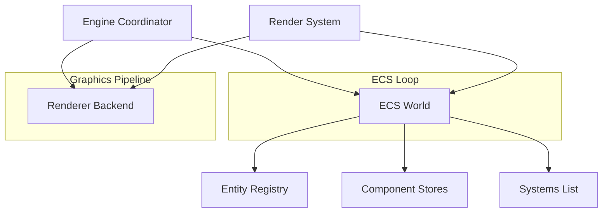
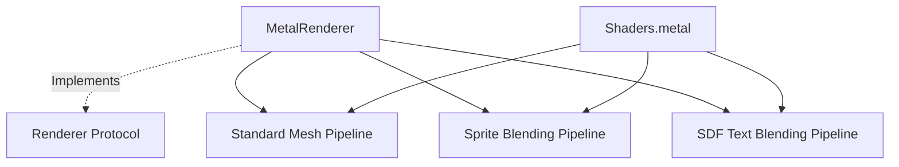

# AcornEngine Documentation

AcornEngine is a modern, high-performance 2D/3D game engine targetting Apple platforms (**iOS 16+** and **macOS 13+**). It is built using **Swift 6** with strict concurrency safety (`Sendable` conformance and `@MainActor` isolation where appropriate) and leverages the **Metal** graphics API for hardware-accelerated rendering.

---

## Architecture Overview

AcornEngine is designed around a modular architecture:


The engine uses three main pillars:
1. **ECS (Entity Component System)**: High-performance data separation where entities are simple IDs, components are pure data structs, and systems contain the logic.
2. **Metal Rendering Backend**: Low-overhead hardware-accelerated graphics pipeline supporting standard meshes, textured sprites, tilemaps, and high-quality Signed Distance Field (SDF) text.
3. **Engine Coordinator**: Manages the game loop by ticking the ECS world (`update`) and triggering the render pass (`render`).

---

## 1. Entity Component System (ECS)

Located under [Engine/Sources/ECS](file:///Users/tsharju/Code/AcornEngine/Engine/Sources/ECS):

### [Entity](file:///Users/tsharju/Code/AcornEngine/Engine/Sources/ECS/Entity.swift)
A lightweight, unique identifier representing an object in the world.
* **Type**: `struct`
* **Conformances**: `Hashable`, `Sendable`
* **Properties**:
  * `id: UInt64`: The unique ID assigned to the entity.

### [Component](file:///Users/tsharju/Code/AcornEngine/Engine/Sources/ECS/Component.swift)
A marker protocol that all components must conform to.
* **Type**: `protocol`
* **Conformances**: `Sendable`
* **Design Guideline**: Components should contain only raw data and state, leaving logic entirely to systems.

### [System](file:///Users/tsharju/Code/AcornEngine/Engine/Sources/ECS/System.swift)
A protocol representing logic that runs on entities and components.
* **Type**: `protocol`
* **Isolation**: `@MainActor`
* **Requirements**:
  * `func update(world: World, deltaTime: Double)`: Performs logic updates on the world state.

### [World](file:///Users/tsharju/Code/AcornEngine/Engine/Sources/ECS/World.swift)
The central registry that manages the lifetime of entities, component storage, and the execution order of systems.
* **Type**: `class`
* **Isolation**: `@MainActor`
* **Key Features**:
  * **Entity Lifetimes**: Creates (`createEntity()`) and destroys (`destroyEntity()`) entities. Destroying an entity automatically cleans up all associated components.
  * **Component Management**: Add, remove, or retrieve components dynamically for any entity via type-safe generics:
    * `addComponent<T: Component>(_ component: T, to entity: Entity)`
    * `removeComponent<T: Component>(ofType type: T.Type, from entity: Entity)`
    * `component<T: Component>(ofType type: T.Type, for entity: Entity) -> T?`
  * **Entity Queries**: Retrieve lists of entities possessing a specific component type via `entities(with type: T.Type)`.
  * **System Registration**: Systems are executed in the order they are registered via `registerSystem(_:)` whenever `update(deltaTime:)` is called.

---

## 2. Rendering & Graphics Pipeline

Located under [Engine/Sources/Renderer](file:///Users/tsharju/Code/AcornEngine/Engine/Sources/Renderer):



### [Renderer (Protocol)](file:///Users/tsharju/Code/AcornEngine/Engine/Sources/Renderer/Renderer.swift)
An abstraction over the graphic device APIs, facilitating potential future multi-backend support.
* **Key Methods**:
  * `createMesh(vertices: [Vertex]) -> Mesh?`: Generates a hardware vertex buffer.
  * `render(mesh: Mesh, uniforms: GlobalUniforms, context: RenderContext)`: Draws a standard 3D mesh.
  * `renderText(mesh: Mesh, texture: any Texture, uniforms: SDFUniforms, context: RenderContext)`: Draws text using the SDF shader.
  * `renderSprite(mesh: Mesh, texture: any Texture, uniforms: SpriteUniforms, context: RenderContext)`: Draws sprites or tile maps using sprite shaders.

### [MetalRenderer](file:///Users/tsharju/Code/AcornEngine/Engine/Sources/Renderer/MetalRenderer.swift)
The concrete implementation of the renderer using Apple's Metal API.
* **Pipelines**: Initializes three separate pipeline states from [Shaders.metal.txt](file:///Users/tsharju/Code/AcornEngine/Engine/Sources/Renderer/Shaders.metal.txt):
  1. **Standard Pipeline**: Simple rendering using vertex colors.
  2. **Sprite Pipeline**: Alpha-blended texture rendering with color tints.
  3. **SDF Text Pipeline**: Alpha-blended rendering mapping distance values to smooth characters and outlines.
* **Context**: Uses `MetalRenderContext` to hold the current command buffer and render pass descriptor. It safely manages a command encoder per frame using locking.

### Texture & Data Loading
* **[Texture (Protocol)](file:///Users/tsharju/Code/AcornEngine/Engine/Sources/Renderer/Texture.swift)**: Common interface for texture resources.
* **[MetalTexture](file:///Users/tsharju/Code/AcornEngine/Engine/Sources/Renderer/MetalTexture.swift)**: Wraps a Metal `MTLTexture`.
* **[TextureLoader](file:///Users/tsharju/Code/AcornEngine/Engine/Sources/Renderer/TextureLoader.swift)**: Decodes images asynchronously from `URL` or `Data` using `MTKTextureLoader`, or uploads raw `[UInt8]` pixel arrays (supporting single-channel `.r8Unorm` for fonts or 4-channel `.rgba8Unorm` formats).

### Mesh & Geometry Basics
* **[Vertex](file:///Users/tsharju/Code/AcornEngine/Engine/Sources/Renderer/Vertex.swift)**: A struct containing:
  * `position: SIMD3<Float>`: 3D position vector.
  * `color: SIMD4<Float>`: Vertex RGBA color.
  * `texCoord: SIMD2<Float>`: Texture coordinate (UV).
* **[MetalMesh](file:///Users/tsharju/Code/AcornEngine/Engine/Sources/Renderer/MetalMesh.swift)**: Implements the opaque `Mesh` protocol, managing an underlying `MTLBuffer` with shared storage.

---

## 3. Advanced Renderer Features

AcornEngine includes highly optimized implementations for sprite sheets, tilemaps, and signed distance field text.

### Sprite Sheets & Tilemaps

```
+---------------------------------------------+
| Sprite Sheet Texture                        |
|                                             |
|   +-----------+         +---------------+   |
|   | Frame "A" |         | Frame "B"     |   |
|   +-----------+         +---------------+   |
+---------------------------------------------+
```

* **[SpriteSheet](file:///Users/tsharju/Code/AcornEngine/Engine/Sources/Renderer/SpriteSheet.swift)**: Stores a compiled texture atlas along with its layout metadata (decoded from standard TexturePacker JSON array/hash structures). Supports trimmed and rotated frames, calculating precise UV rects.
* **[SpriteMeshGenerator](file:///Users/tsharju/Code/AcornEngine/Engine/Sources/Renderer/SpriteMeshGenerator.swift)**:
  * Generates centered quads matching a sprite's source aspect ratio and offset metrics.
  * Generates optimized grid vertices for `TileMapComponent` instances by skipping empty tiles and batching them into a single mesh.

### Signed Distance Field (SDF) Text Rendering

SDF text rendering maintains extreme sharpness and legibility even when scaled or viewed at steep angles, bypassing the pixelation typical of pixel-map text.

```
Grayscale Raster Glyphs ===(SDF Search Radius)===> Distance Field Texture (1 Channel)
```

* **[SDFFontAtlasGenerator](file:///Users/tsharju/Code/AcornEngine/Engine/Sources/Renderer/SDFFontAtlasGenerator.swift)**: Generates font atlases dynamically at runtime using CoreText.
  1. Renders glyph contours onto a high-resolution grayscale bitmap.
  2. Runs a 2D bounding distance search inside/outside glyph edges up to a specified search radius.
  3. Packages distance values into a single-channel `.r8Unorm` atlas texture.
  4. Calculates metrics (`size`, `offset`, `xAdvance`, `lineHeight`) for layout.
* **[TextMeshGenerator](file:///Users/tsharju/Code/AcornEngine/Engine/Sources/Renderer/TextMeshGenerator.swift)**: Evaluates glyph sequences, handles carriage returns (`\n`), wraps tabs/spaces, and constructs a contiguous triangle stream (quads) in local space.
* **SDF Shader**: Processes distance values inside [Shaders.metal.txt](file:///Users/tsharju/Code/AcornEngine/Engine/Sources/Renderer/Shaders.metal.txt#L61-L83) using `smoothstep` edge thresholds:
  * **Anti-aliasing**: Interpolates using a configurable `edgeWidth`.
  * **Outlines**: Employs an `outlineWidth` and `outlineColor` layer rendered underneath the core text body.

---

## 4. Components

Located under [Engine/Sources/Core/Components](file:///Users/tsharju/Code/AcornEngine/Engine/Sources/Core/Components):

### [TransformComponent](file:///Users/tsharju/Code/AcornEngine/Engine/Sources/Core/Components/TransformComponent.swift)
Stores the physical placement of an entity in the virtual world.
* **Properties**:
  * `position: SIMD3<Float>`: Coordinates in 3D space.
  * `rotation: SIMD3<Float>`: Euler rotation angles in radians.
  * `scale: SIMD3<Float>`: Scaling factor (default is `[1.0, 1.0, 1.0]`).
  * `matrix: simd_float4x4`: Derived 4x4 model matrix computed via Translation * Rotation * Scale.

### [MeshComponent](file:///Users/tsharju/Code/AcornEngine/Engine/Sources/Core/Components/MeshComponent.swift)
Assigns a pre-built static 3D geometry to an entity for rendering.
* **Properties**:
  * `mesh: any Mesh`: An opaque GPU mesh resource.

### [SpriteComponent](file:///Users/tsharju/Code/AcornEngine/Engine/Sources/Core/Components/SpriteComponent.swift)
Configures an entity to render as a 2D textured quad.
* **Properties**:
  * `spriteSheet: SpriteSheet`: The underlying atlas.
  * `frameName: String`: Name of the frame within the sheet.
  * `color: SIMD4<Float>`: Tint color (multiplied during rendering).
  * `mesh: (any Mesh)?`: Cached mesh buffer.
  * `isDirty: Bool`: Flag signaling the RenderSystem to rebuild the geometry when frame or color parameters change.

### [TileMapComponent](file:///Users/tsharju/Code/AcornEngine/Engine/Sources/Core/Components/TileMapComponent.swift)
Draws a large grid of static sprite tiles.
* **Properties**:
  * `spriteSheet: SpriteSheet`: Atlas containing the tile textures.
  * `columns: Int` / `rows: Int`: Horizontal/vertical tile counts.
  * `tileSize: SIMD2<Float>`: Dimensions of each tile in world units.
  * `tiles: [String]`: Row-major array storing frame names (empty string = empty tile).
  * `color: SIMD4<Float>`: Global tile map tint color.
  * `mesh: (any Mesh)?`: Cached unified grid geometry.
  * `isDirty: Bool`: Indicates if the mesh requires regeneration.
* **Key Methods**:
  * `mutating func setTile(column: Int, row: Int, frameName: String)`: Safely replaces tile reference and marks the grid dirty.

### [TextComponent](file:///Users/tsharju/Code/AcornEngine/Engine/Sources/Core/Components/TextComponent.swift)
Enables rendering of rich 3D labels.
* **Properties**:
  * `text: String`: The message to display.
  * `fontAtlas: FontAtlas`: Reference font details.
  * `textColor: SIMD4<Float>`: Primary text body color.
  * `outlineColor: SIMD4<Float>`: Surrounding outline color.
  * `outlineWidth: Float`: Thickness of the outline boundary `[0.0 - 0.5]`.
  * `edgeWidth: Float`: Smoothness factor for anti-aliasing.
  * `mesh: (any Mesh)?`: Cached vertex buffer.
  * `isDirty: Bool`: Indicates if the text mesh must be regenerated.

### [CameraComponent](file:///Users/tsharju/Code/AcornEngine/Engine/Sources/Core/Components/CameraComponent.swift)
Declares viewport and projection matrices for rendering.
* **Properties**:
  * `projectionType: ProjectionType`: `.orthographic` or `.perspective`.
  * `orthographicSize: Float`: Vertical half-size for ortho mode.
  * `fovY: Float`: Vertical field of view in radians for perspective mode.
  * `nearZ` / `farZ`: Clipping bounds.
  * `aspectRatio: Float`: Screen aspect ratio.
* **Key Methods**:
  * `func projectionMatrix() -> simd_float4x4`: Returns a matrix optimized for Metal's `[0, 1]` depth range.

### [CameraTrackingComponent](file:///Users/tsharju/Code/AcornEngine/Engine/Sources/Core/Components/CameraTrackingComponent.swift)
Commands a camera entity to follow another entity smoothly.
* **Properties**:
  * `target: Entity`: The target entity.
  * `offset: SIMD3<Float>`: Static relative tracking offset.
  * `smoothing: Float`: Interpolation coefficient clamped between `[0.001 - 1.0]` (lower means smoother delay).

### [CameraOrbitComponent](file:///Users/tsharju/Code/AcornEngine/Engine/Sources/Core/Components/CameraOrbitComponent.swift)
Commands a camera entity to perform floating orbits around a focal target.
* **Properties**:
  * `target: Entity`: Focal point.
  * `radius: Float`: Distance from the target.
  * `speed: Float`: Orbital rotation speed (rad/s).
  * `baseHeight: Float`: Default height offset.
  * `bobbingAmplitude` / `bobbingSpeed`: Height bobbing oscillation values.
  * `swayAmplitude` / `swaySpeed`: Horizontal sway oscillation values.
  * `useAngleSway: Bool`: If true, sways back-and-forth instead of doing a complete orbit.
  * `swayAngleAmplitude: Float`: Magnitude of back-and-forth angle sway.
  * `time: Double`: Accumulator tracking duration.
  * `angle: Float`: Base rotation angle.

---

## 5. ECS Systems

Located under [Engine/Sources/Core/Systems](file:///Users/tsharju/Code/AcornEngine/Engine/Sources/Core/Systems):

### [CameraSystem](file:///Users/tsharju/Code/AcornEngine/Engine/Sources/Core/Systems/CameraSystem.swift)
Updates camera positions and orientations.
* **Operation**:
  * **Standard Tracking**: For entities with `CameraTrackingComponent` and `TransformComponent`, it fetches the target's transform and linearly interpolates (LERP) the camera's position:
    $$\vec{p}_{cam} = \text{mix}(\vec{p}_{cam}, \vec{p}_{target} + \vec{o}_{offset}, s_{smoothing})$$
  * **Orbit & Sway**: For entities with `CameraOrbitComponent` and `TransformComponent`, it accumulates elapsed time, calculates orbit angles (optionally using `sin` for angular sway), applies vertical bobbing/horizontal sway offsets, and positions the camera. Finally, it calculates pitch and yaw Euler angles to keep the camera pointing directly at the target.

### [RenderSystem](file:///Users/tsharju/Code/AcornEngine/Engine/Sources/Core/Systems/RenderSystem.swift)
The pipeline bridge that retrieves visible components, updates dynamic buffers, and builds render commands.
* **Operation**:
  1. **View-Projection Extraction**: Searches for the first active `CameraComponent` in the world. If present, it retrieves its parent entity's `TransformComponent` matrix, takes its inverse to produce the *View Matrix*, and multiplies it by the camera's *Projection Matrix* to get the combined `viewProjectionMatrix`.
  2. **Mesh Rebuilding**: Inspects all `SpriteComponent`, `TextComponent`, and `TileMapComponent` entities. If the `isDirty` flag is true, it triggers generation algorithms to produce a new set of vertices, uploads them to the GPU via `renderer.createMesh(vertices:)`, caches the returned mesh, and resets the dirty flag.
  3. **Uniform Packaging & Drawing**:
     * Iterates over `MeshComponent` entities, calculates the MVP matrix, and submits them to `renderer.render`.
     * Iterates over `TextComponent` entities, scales them down by a base scaling factor (`0.003`), binds the atlas texture, packages outline parameters into `SDFUniforms`, and calls `renderer.renderText`.
     * Iterates over `SpriteComponent` and `TileMapComponent` entities, binds their sprite sheet texture, packages colors into `SpriteUniforms`, and calls `renderer.renderSprite`.

---

## 6. Core Math Extensions

Located under [Engine/Sources/Core/Math.swift](file:///Users/tsharju/Code/AcornEngine/Engine/Sources/Core/Math.swift):

Extends `simd_float4x4` with projection and transform helpers tailored for Metal (where Normalized Device Coordinates mapping for Z is $[0, 1]$):
* **Identity**: `simd_float4x4.identity` returns `matrix_identity_float4x4`.
* **Translation**: `init(translation: SIMD3<Float>)`
* **Scale**: `init(scale: SIMD3<Float>)`
* **Rotations**: Individual axis matrix initialization (`init(rotationX:)`, `init(rotationY:)`, `init(rotationZ:)`) and composite Euler angles (`init(rotation:)`).
* **Model Matrix**: `init(position:rotation:scale:)` combining Translation * Rotation * Scale matrices.
* **Orthographic Projection**: 
  $$\mathbf{P}_{ortho} = \begin{bmatrix} \frac{2}{r-l} & 0 & 0 & -\frac{r+l}{r-l} \\ 0 & \frac{2}{t-b} & 0 & -\frac{t+b}{t-b} \\ 0 & 0 & \frac{1}{f-n} & -\frac{n}{f-n} \\ 0 & 0 & 0 & 1 \end{bmatrix}$$
* **Perspective Projection**:
  $$\mathbf{P}_{persp} = \begin{bmatrix} \frac{1}{a \tan(\theta/2)} & 0 & 0 & 0 \\ 0 & \frac{1}{\tan(\theta/2)} & 0 & 0 \\ 0 & 0 & \frac{f}{f-n} & 1 \\ 0 & 0 & -\frac{n f}{f-n} & 0 \end{bmatrix}$$
  *(Note the transposed columns layout mapping to SIMD structures)*
